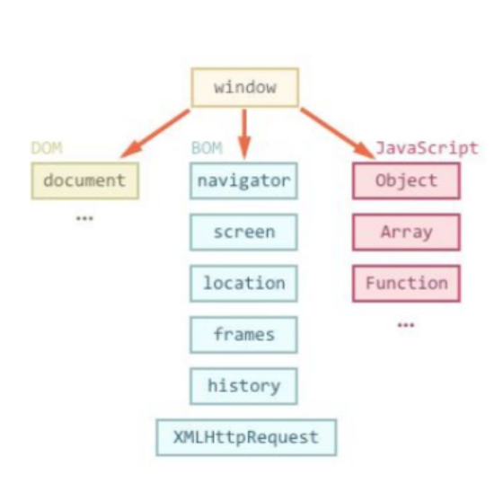
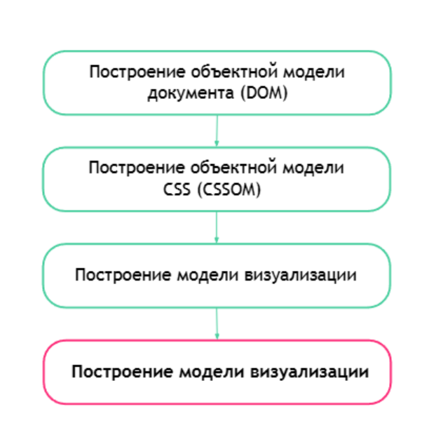

### Использование JavaScript в браузере

* Подключение JS
* Синхронное и асинхронное выполнение скриптов JS (async/defer)
* Консоль разработчика
* debugging

Браузер - это ПО для отображения веб страниц. Основные движки, на которых работают браузеры: 
  * Blink - Google Chrome, Edge, Yandex и тд
  * Webkit - Safari
  * Gekko - Firefox

Каждый браузер имеет объект window и три важных элемента:
* DOM - объектная модель документа (структура и внешний вид страницы(CSSOM))
* BOM - объектная модель браузера (набор служебных методов, с помощью которого происходит взаимодействие с браузером(отслеживает fetch -позволяет браузеру отправлять запросы(GET, POST, ...), отслеживает информацию о локации, времени, и тд))
* JavaScript - это не просто язык программирования, это реализация
  спецификации ECMA-262, которая описывает что, как и зачем должно
  работать. JS отвечает за взаимодействие пользователя и сайта (прокрутка страницы вниз - скрипт выгрузит новые записи, нажми на кнопку - сайт откроет выпадающее меню)



**Подключение**
```
//простая веб страница
<html> 
   <head>
      <title></title>
   </head>
   <body>
      Привет
       // тег для добавления скрипта в HTML-документ
       <script> 
          console.log("Мир!")
          ;
       </script>
       <script src="index.js"></script>  // указывается путь к документу (относительный или абсолютный) 
       <script src="https://ajax.googleapis.com/ajax/libs/jquery/3.1.1/jquery.min.js"></script>  // пример добавления JS из внешнего источника 
       
   </body>
</html>
```
**Этапы вывода страницы на экран**

Сначала строится каркас страницы, затем добавляется CSS - то есть создается модель визуализации, которая отображается на странице


**Этапы запроса страницы в интернете** 
* Ввод URL в браузере:
   * Пользователь вводит URL (например, https://example.com) в адресную строку браузера.
* Разрешение доменного имени через DNS:
   * Браузер обращается к DNS-серверу для преобразования доменного имени в IP-адрес.
   * Браузер проверяет наличие IP-адреса в локальном кэше (например, в куках или системе кэширования DNS).
   * Если IP-адрес не найден, браузер запрашивает его у DNS-сервера.
* Установление TCP-соединения:
   * После получения IP-адреса браузер устанавливает TCP-соединение с сервером. Для HTTP используется порт 80, для HTTPS — порт 443.
* Отправка HTTP-запроса:
   *Браузер отправляет HTTP-запрос (например, GET-запрос) на сервер.
* Получение ответа от сервера:
   * Сервер обрабатывает запрос и отправляет ответ, который обычно включает HTML-документ.
* Парсинг HTML:
   * Браузер начинает парсить HTML-документ и строить DOM (Document Object Model) — дерево элементов страницы.
* Загрузка CSS:
   * Браузер загружает CSS-файлы и строит CSSOM (CSS Object Model) — дерево стилей.
* Обработка JavaScript:
   * Браузер асинхронно загружает и выполняет JavaScript-файлы, которые могут изменять DOM и CSSOM(подгружается реклама, счетчики, геолокация).
* Создание визуальной модели:
   * На основе DOM и CSSOM браузер создает модель визуализации (Render Tree) и отображает её на экране.
* Отображение страницы:
   * Браузер отображает страницу на экране пользователя.


**Синхронное отображение страницы**

Элементы отображаются по порядку. Если на странице есть элементы JS, то браузер выводит данные до скрипта, затем обрабатывает сам скрипт, и только после этого дальше продолжает обрабатывать страницу.

Решить эту проблему помогают атрибуты:

* defer - гарантирует, что порядок обработки скриптов будет сохранен, даже если скрипт два загрузится быстрее, при этом скрипты только начнут работать только после того, как браузер полностью построит модель визуализации страницы
```
<script src="./first.js" defer></script>
<script src="./second.js" defer></script>
```
* async - запускает работу скрипта при его обнаружении, при этом браузер не останавливает обработку страницы


**События**

Приложение в браузере чаще всего построено на взаимодействии с пользователем. С точки зрения JavaScript, такое взаимодействие построено на основе
событий и обработчиков этих событий.

**Способы получения HTML-элементов**

Для получения элементов используются методы:
* ```getElementsByTagName() ```   - поиск по имени тега
* ```getElementsByClassName()```  - поиск по имени класса
* ```getElementsByName() ```      - поиск по имени
* ```getElementById()```          - поиск по ID

```
let images = document.getElementsByTagName("img"); 
let colors = document.getElementsByClassName("blue"); 
let elements = document.getElementsByName("age"); 
let text = document.getElementById("text");
```

* ```querySelector()``` 
* ```querySelectorAll```

```
// Получаем все элементы списка с классом "exclusive"
let exclusiveElements = document.querySelectorAll("ul.exclusive li");

// Получаем первый элемент списка, у которого есть класс "exclusive"
let exclusiveElement = document.querySelector("ul li.exclusive");

```

**Дополнения**
```
// методы глобального объекта window
window.open("https://ya.ru") - позволяет открыть сайт через консоль
window.close() - позволяет закрыть страницу через консоль

// объект window
document - объектная модель документа, в которой находится все что находится на странице
document.write("Здесь был Вася") - в пределах сессии  переписывает структуру текущей страницы и выводи на экране текст из кавычек

// поиск элементов через консоль
$0 - выведет последний элемент к которому было обращение
$1 - выведет предпоследний элемент

$1.style.backgroundColor = "green" - поменяет цвет фона предпоследнего элемента

//тестирование смены часовых поясов
//настройки - more tools - sensors   - в location выбирается город, после этого приложение будет показывать работу приложения в выбранном регионе.


```

