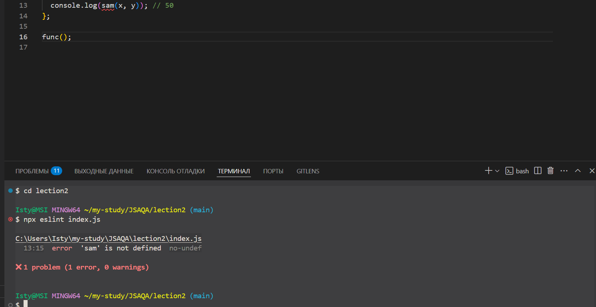
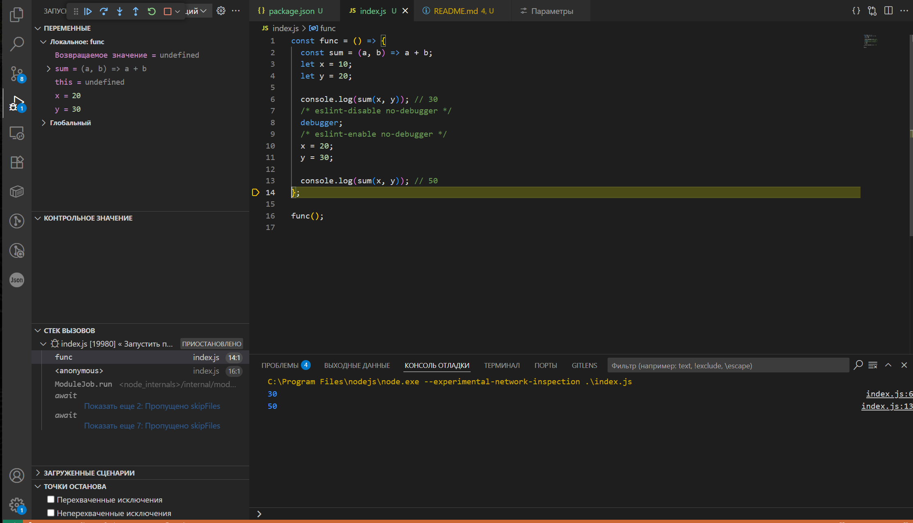

### Установка Node.js:

Node.js — это open source кроссплатформенная среда выполнения JavaScript кода вне браузера.

[Скачать Node.js](https://nodejs.org/ru/download/)
Mac OS X: ```brew install node```
Ubuntu: ```sudo snap install node --classic```
Для проверки установки используется команда: ```node -v```

### Библиотеки для Node.js:

[Инструкции:](https://nodejs.org/en/learn/getting-started/introduction-to-nodejs)

[npmjs.com](npmjs.com)  -  крупнейший реестр свободно распространяемых программ и библиотек.

### Создание проекта:

* Создание проекта: ```npm init```

   Основные поля package.json
  * name - уникальное поле, является обязательным, если пакет будет опубликован.
  * version - уникальное поле, является обязательным, если пакет будет опубликован. Опубликовать пакет с одним и тем же именем и номером версии нельзя. Любые изменения в опубликованном пакете должны сопровождаться изменением версии.
  * description - описание проекта
  * keywords - ключевые слова для поиска, заполняются если они нужны.
  * author, contributors - Автор — это один человек(создатель проекта), а контрибьюторы — это массив людей.
  * repository - ссылка на репозиторий, в котором хранится исходный код пакета.
  * main - определяет главный файл/модуль, который будет загружен во время выполнения require() этого пакета. Это должен быть путь до js-файла относительно package.json.
  * bin - если пакет предоставляет утилиту(ы) командной строки, это отражается в свойстве bin: ```"bin": {"simple-date": "date.js" }```
  * scripts -  поле удобно использовать для записи различных команд, которые нужны во время разработки, а также для публикации или во время установки пакета. Запуск осуществляется через ```npm run name_scripts или node index.js```
  * dependencies, devDependencies(--save-dev) - блоки для  подключения зависимостей. Блок devDependencies - используется для зависимостей, которые будут использовать только разработчики

**Нумерация в версии патча**: 14-мажор /4-минор/ 1-патч

```"^14.4.1"``` - ^ означает версию можно обновить токо до минор

```"~14.4.1"``` - ~ означает что обновить можно только до  патч

**Зависимости**:

  1. Необходимо скачать расширение для VScode
  2. Скачать зависимость в проект через ```npm instal название_файла или npm install --save-dev название_файла``` (```npm install --save-dev eslint```, ```npm i --save-dev prettier```, ```npm i js-beautify```)
  3. Создать файл конфигурации(```npx eslint --init```, ```touch .prettierrc```)
  4. В настройках, в строке поиска ввести ```format```  и в ```Default Formatter``` выбрать название расширения
  5. ```npx eslint index.js``` - запуск eslint
  6. ```npx eslint --fix index.js```  - исправление ошибок
  7. ```Editor: Format On Save``` и ```Editor: Format On Paste``` - если поставить галочки то форматирование Prettier будет происходить автоматически при сохранении.

```npm outdated``` - откроет просмотр текущий версии проекта и актуальной

```npm update --save```  - обновляет до максимально возможной версии c сохранением изменений в файле package.json

```npm uninstall package-name``` - удаление зависимости

Npm генерирует файл ```package-lock.json```

```npm install``` - заново скачивает все необходимые зависимости из ранее созданного файла package.json

Подсказка: открытие vscode из коммандной строки ```code .```

Пример настроек для ```.prettierrc```:

```
{
  "printWidth": 100, // Максимальная ширина строки
  "tabWidth": 2, // Ширина табуляции
  "useTabs": false, // Использовать табуляцию вместо пробелов
  "semi": true, // Добавлять точку с запятой в конце выражений
  "singleQuote": true, // Использовать одинарные кавычки
  "trailingComma": "es5", // Добавлять запятую в конце списка элементов
  "bracketSpacing": true, // Добавлять пробелы внутри фигурных скобок
  "arrowParens": "always", // Всегда использовать круглые скобки для стрелочных функций
  "endOfLine": "lf" // Использовать LF (Unix-style) для конца строки
}
```



